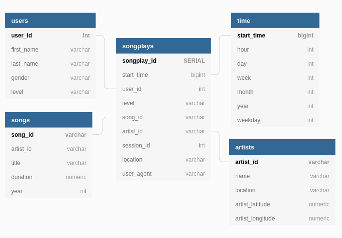

# SDLEP: Sparkify Data Lake ETL pipeline
SDLEP is a project for an imaginary music streaming startup called Sparkify. Sparkify, has grown their user base and song database even more and want to move their data warehouse to a data lake. SDLEP build an ETL pipeline that extracts their data from S3, processes them using Spark, and loads the data back into S3 as a set of dimensional tables.

# SDLEP files:
the SCEP project includes four files but two files are required to run the script.
* README.md
* test.ipynb
* dl.cfg - Necessary - Data Lake config file. you must edit this
* etl.py - Necessary - load data from S3 into staging tables, process that data into the five fact\dimension tables and loads the data back into S3. - you must put your output data path on output_data in main function

# Prerequisites
All libraries you need to install:
* pyspark.sql 
* configparser
* os
* datetime

# How to create the data lake using SDLEP:
First, we need edit dwh.cfg file.
Second, we need put our output data path in etl.py
Third, run:
###### python3 etl.py